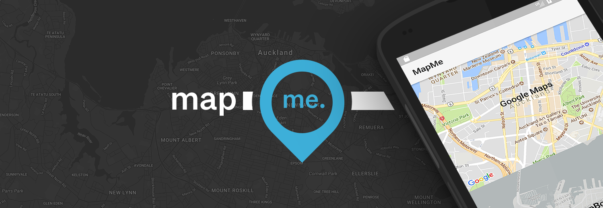

# MapMe



MapMe is an Android library for working with Maps. MapMe brings the adapter pattern to Maps, simplifying the management of markers and annotations.

MapMe supports both [Google Maps](https://developers.google.com/maps/documentation/android-api/) and [Mapbox](https://www.mapbox.com/android-sdk/)


Download
-----

```groovy
//base dependency
compile 'nz.co.trademe.mapme:mapme:1.0.0'
  
//for Google Maps support
compile 'nz.co.trademe.mapme:googlemaps:1.0.0'
  
//for Mapbox support
compile 'nz.co.trademe.mapme:mapbox:1.0.0'

```

Usage
-----
A simple MapsAdapter might look like this:

```java
public class MapsAdapter extends GoogleMapMeAdapter {
  
    private final List<MarkerData> markers;
  
    public MapsAdapter(Context context, List<MarkerData> markers) {
        super(context);
        this.markers = markers;
    }
  
    @Override
    public MapAnnotation<GoogleMap> onCreateAnnotation(AnnotationFactory<GoogleMap> factory, int position, int annotationType) {
        MarkerData item = this.markers.get(position);
        return factory.createMarker(item.getLatLng(), null, item.getTitle());
    }
  
    @Override
    public void onBindAnnotation(MapAnnotation<? super GoogleMap> annotation, int position, Object payload) {
        if (annotation instanceof MarkerAnnotation) {
            
            MarkerData item = this.markers.get(position);
            ((MarkerAnnotation) annotation).setTitle(item.getTitle());
        }
    }
  
    @Override
    public int getItemCount() {
        return markers.size();
    }
}

```

Using the adapter in your view:

```java

MapMeAdapter adapter = new GoogleMapMeAdapter(context, items);
adapter.setOnAnnotationClickListener(this);
  
mapView.getMapAsync(new OnMapReadyCallback() {
            @Override
            public void onMapReady(@NonNull GoogleMap googleMap) {              
                //Attach the adapter to the map view once it's initialized
                adapter.attach(mapView, googleMap);
            }
}
```

More complex adapters can override **getItemAnnotationType** to work with multiple annotations.

Why the adapter pattern?
-----

Working with a few map markers is simple, but working with hundreds can become a mess of spaghetti code. 

The adapter pattern provides a clear separation of data from the view, allowing the data to be manipulated freely without the concern of updating the view.

## DiffUtil
As well as support for standard Adapter methods such as *notifyDataSetChanged*, and *notifyItemInserted*, MapMe supports (and recommends) DiffUtil.

DiffUtil is where the true power of MapMe comes into play. Simple manipulate the data set, calculate the diff and dispatch it to MapMe. The map will instantly reflect the data.

A DiffResult can be dispatched to the MapAdapter just as you would a RecyclerView:

```java
DiffUtil.DiffResult diffResult = DiffUtil.calculateDiff(new MarkerDiffCallback(this.markers, newMarkers));
diffResult.dispatchUpdatesTo(mapAdapter);
```

Markers and Annotations
-----
MapMe is based around the concept of Annotations. An annotation is anything displayed on the map.

The only annotation currently supported is Markers. We hope to support many more in the future.

*We'd love PR's adding support for more annotations!*


### AnnotationFactory
MapMe differs from list adapters in that the creation of annotations must be left up to the map as they are not standard Android views.

The MapAdapter **onCreateAnnotation** method provides an **AnnotationFactory** as a parameter that must be used to create and return Map Annotations.


## Sample

Check out the sample project for an example
